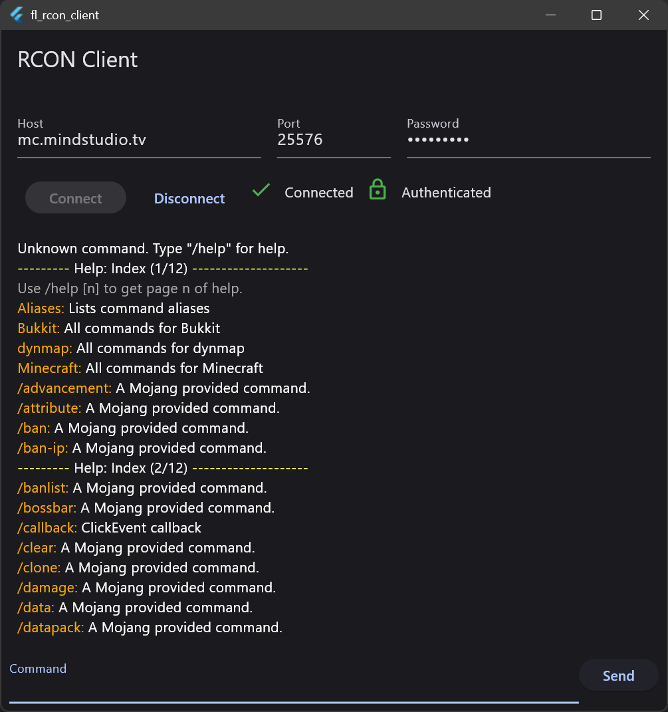

# Minecraft RCON Client

## built with Flutter



This is a simple RCON client for Minecraft servers. It is built with Flutter and Dart.

## Platform Support

Theoretically, this app should work on all platforms that Flutter supports. However, it has only been tested on Windows. If you have tested it on another platform, please let me know by opening an issue.

| Android |  iOS  | MacOS | Windows | Linux |
| :-----: | :---: | :---: | :-----: | :---: |
|    ✅    |   ❓   |   ❓   |    ✅    |   ❓   |

## Getting Started

To get started, you will need to have Flutter installed on your machine. You can find the installation instructions [here](https://flutter.dev/docs/get-started/install).

Once you have Flutter installed, you can clone this repository and run the following command in the root directory of the project:

```bash
flutter run
```

This will start the app in debug mode. If you want to build the app for release, you can run the following command:

```bash
flutter build <platform>
```

Replace `<platform>` with the platform you want to build for. For example, if you want to build for Windows, you would run:

```bash
flutter build windows
```

## Contributing

If you would like to contribute to this project, please open an issue or a pull request. I would love to hear your feedback and see your contributions.

## License

This project is licensed under the GNU General Public License v3.0. You can find the full license [here](COPYING).
